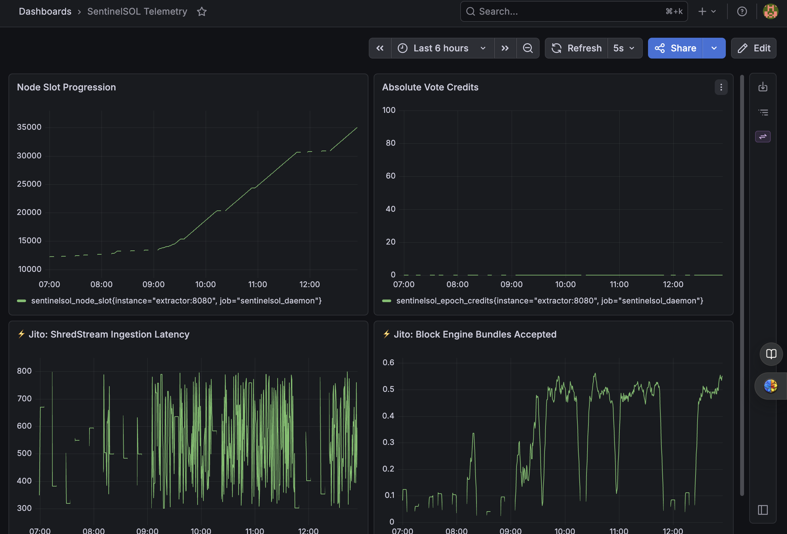

# SentinelSOL 🛡️


**Predictive SRE Observability Pipeline for Solana Validators**

🔴 Live Demo & Next.js Frontend: https://sentinelsol-sre.vercel.app/

*Built for the Colosseum Hackathon 2026*



## 📜 The Genesis: Surviving the Prune
The era of 'set and forget' validation on Solana is over. Recently, the Solana Foundation Delegation Program (SFDP) shifted from blindly incentivizing decentralization to ruthlessly enforcing node performance. With the introduction of the 3-to-1 pruning rule and active stake-stripping for delinquency, a node's profitability is now entirely dependent on its uptime and Timely Vote Credits (TVC).

SentinelSOL was built because traditional alerting is too slow to save your delegated stake in this performance regime. You cannot afford to wait for a crash; you have to predict the degradation.

**Context & Receipts:**
* [The Solana Foundation Delegation Program Case Study (Phase II)](https://solana.com/news/solana-foundation-delegation-program-case-study)
* [Blockworks: Solana Foundation begins pruning validators from delegation program](https://blockworks.com/news/solana-foundation-pruning-validators-delegation)

---

## 🛑 The Problem: Silent Delinquency
Current Solana validator monitoring tools act as "Check Engine" lights that only illuminate when the engine is already on fire. Operators rely on absolute thresholds (e.g., node offline, port closed). By the time these alerts fire, the validator is already delinquent, missing votes, and actively losing revenue.

## 🟢 The Solution: Statistical Anomaly Detection
SentinelSOL is an out-of-band (OOB) observability pipeline that detects hardware and network exhaustion *before* it results in on-chain delinquency. 

Instead of waiting for the node to crash, our Golang extraction engine tracks the velocity of **Timely Vote Credits (TVC)** relative to the absolute **Slot Processing Height** in real-time. By utilizing PromQL mathematics, SentinelSOL establishes a rolling 1-hour performance baseline. 

We utilize **Z-Score Anomaly Detection** to dynamically learn the validator's rhythm. If the real-time efficiency drops **3 standard deviations** below its historical norm, SentinelSOL proactively pages the operator via Telegram. 

Catch the degradation. Save the revenue.

---

## 🏗️ Architecture

SentinelSOL decouples the extraction, logic, and alerting layers to ensure high availability and clean separation of concerns.

The architecture is completely environment-agnostic: operators inject an `RPC_URL` environment variable to target any Solana RPC source. That can be a local `solana-test-validator` for out-of-band extraction during development, or a dedicated Mainnet RPC node such as Helius for live production monitoring.

* **Solana Node:** Local `solana-test-validator` emitting JSON-RPC telemetry.
* **Go Extractor:** A concurrent daemon fetching Epoch Credits and Slot Height synchronously to prevent metric time-drift.
* **Prometheus:** Time-series database executing Z-Score anomaly detection against historical baselines.
* **Alertmanager:** Handles alert deduplication, rate-limiting, and webhook routing.
* **Telegram API:** Native mobile paging via SentinelBot.
* **Grafana:** Real-time UI dashboarding, fully provisioned via Dashboards-as-Code.

---

## 🏗️ Advanced Architecture: True Out-of-Band (OOB) Deployment

To achieve zero-trust reliability, SentinelSOL is designed to run Out-of-Band. Instead of consuming CPU cycles on a high-performance bare-metal validator, operators can deploy this Docker stack on an isolated $5 VPS and point the `RPC_URL` to their validator's secure tunnel. This guarantees that if the validator experiences a kernel panic or severe network DDoS, the observability stack survives to trigger SRE alerts.

Configure OOB mode in your `.env`:
```bash
RPC_URL=http://<VALIDATOR_IP>:8899
```

See `.env.example` for the full deployment mode reference.

---

## 📂 Project Structure

```text
SentinelSOL/
├── .github/                    # CI & Issue/PR Templates
├── cmd/
│   └── sentinelsol/
│       └── main.go             # Concurrent Go Daemon
├── config/
│   ├── alertmanager.yml        # Webhook & Routing Logic
│   ├── alerts.rules.yml        # Predictive Z-Score PromQL Math
│   ├── grafana/                # GitOps: Dashboards-as-Code
│   └── prometheus.yml          # Scrape Configs
├── .dockerignore               # Container build optimization
├── .env.example                # Local configuration template
├── docker-compose.yml          # Local orchestrator
├── docker-compose.prod.yml     # Out-of-Band (OOB) Server orchestrator
├── tools/
│   └── mock-jito/
│       └── main.go             # Simulated Jito metrics for demo
├── Dockerfile                  # Multi-stage Go compilation
└── Makefile                    # Infrastructure abstraction commands
```

## ⚡ Quickstart Guide

**One-liner deploy:**
```bash
docker-compose up -d --build
```

| Service | URL |
|---------|-----|
| **Grafana Dashboard** | `http://localhost:3000` |
| **Prometheus** | `http://localhost:9090` |
| **SentinelSOL Frontend** | [sentinelsol-sre.vercel.app](https://sentinelsol-sre.vercel.app/) |

**Full setup:**

1. **Phase 1: Telegram Routing**  
   Message **@BotFather** on Telegram to create a bot and get the Bot Token. Message **@userinfobot** to get the Chat ID.
2. **Phase 2: Environment**  
   Copy the template and inject runtime credentials:
   ```bash
   cp .env.example .env
   ```
   Populate `TELEGRAM_BOT_TOKEN`, `TELEGRAM_CHAT_ID`, and `GRAFANA_ADMIN_PASSWORD` in `.env`.
3. **Phase 3: Boot**  
   Build and launch the isolated Docker network:
   ```bash
   make up
   ```
   Open `http://localhost:3000` to view SentinelSOL telemetry.

## 🚀 Future Roadmap

- **Enterprise Paging:** Webhook integrations for PagerDuty and Opsgenie for strict on-call escalation policies.
- **Twilio SMS Fallback:** Redundant SMS alerts if the Telegram API rate-limits or drops.
- **Predictive Disk Exhaustion:** Adding eBPF kernel tracing to predict ledger storage saturation before the validator OS halts.
- **Automated Chaos Testing:** Full-coverage Go unit tests and network-partition chaos experiments to validate the alerting pipeline under stress. This was scoped for Phase 2 so the core Z-Score prediction engine could be locked in during the hackathon sprint.
