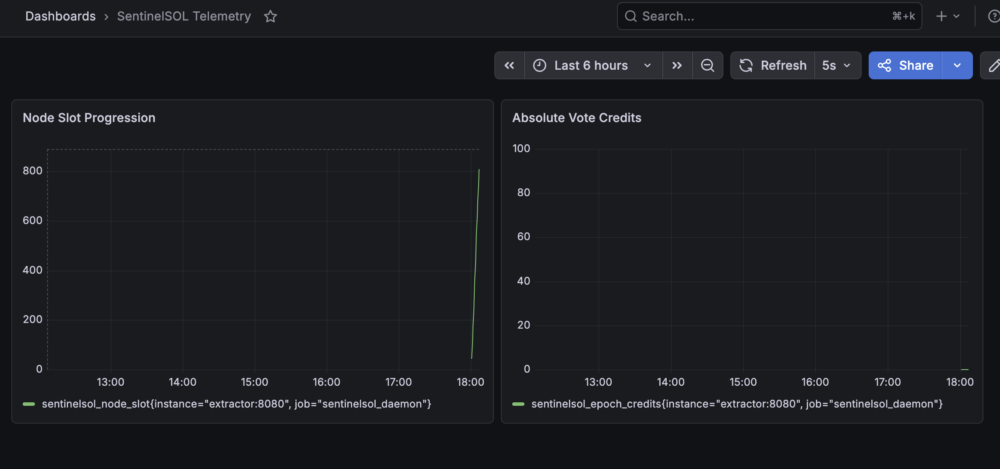

# SentinelSOL 🛡️


**Distributed Validator Node Monitoring for Solana** — Go, Prometheus, PromQL, Alertmanager, Grafana

🔴 Live Demo & Next.js Frontend: https://sentinelsol-sre.vercel.app/

*Winner, Superteam Germany / neosfer Solana Ideathon, Frankfurt 2026. Also submitted to the Colosseum Frontier hackathon.*



## 📜 The Genesis: Surviving the Prune
The era of 'set and forget' validation on Solana is over. Recently, the Solana Foundation Delegation Program (SFDP) shifted from blindly incentivizing decentralization to ruthlessly enforcing node performance. With the introduction of the 3-to-1 pruning rule and active stake-stripping for delinquency, a node's profitability is now entirely dependent on its uptime and Timely Vote Credits (TVC).

SentinelSOL was built because traditional alerting is too slow to save your delegated stake in this performance regime. You cannot afford to wait for a crash; you have to predict the degradation.

**Context & Receipts:**
* [The Solana Foundation Delegation Program Case Study (Phase II)](https://solana.com/news/solana-foundation-delegation-program-case-study)
* [Blockworks: Solana Foundation begins pruning validators from delegation program](https://blockworks.com/news/solana-foundation-pruning-validators-delegation)

---

## 🛑 The Problem: Silent Delinquency
Current Solana validator monitoring tools act as "Check Engine" lights that only illuminate when the engine is already on fire. Operators rely on absolute thresholds (e.g., node offline, port closed). By the time these alerts fire, the validator is already delinquent, missing votes, and actively losing revenue.

## 🟢 The Solution: Statistical Anomaly Detection
SentinelSOL is a separate-process observability pipeline that detects hardware and network exhaustion *before* it results in on-chain delinquency. 

Instead of waiting for the node to crash, the Go extraction engine exports **vote-credit accrual** and **slot progression** straight from the validator's JSON-RPC. Prometheus derives vote-credit velocity as a recording rule and establishes a rolling 1-hour performance baseline learned from the node's own history. 

We utilize **Z-Score Anomaly Detection** to dynamically learn the validator's rhythm. If the real-time efficiency drops **3 standard deviations** below its historical norm, SentinelSOL proactively pages the operator via Telegram. 

Catch the degradation. Save the revenue.

---

## 🏗️ Architecture

SentinelSOL decouples the extraction, logic, and alerting layers for clean separation of concerns.

The architecture is completely environment-agnostic: operators inject an `RPC_URL` environment variable to target any Solana RPC source. That can be a local `solana-test-validator` during development, or a dedicated Mainnet RPC node such as Helius for live monitoring.

* **Solana Node:** Local `solana-test-validator` emitting JSON-RPC telemetry.
* **Go Extractor:** A daemon fetching Epoch Credits and Slot Height concurrently under a `sync.WaitGroup`, so both metrics share a timestamp and cannot drift apart.
* **Prometheus:** Time-series database executing Z-Score anomaly detection against historical baselines.
* **Alertmanager:** Handles alert deduplication, rate-limiting, and webhook routing.
* **Telegram API:** Native mobile paging via SentinelBot.
* **Grafana:** Real-time UI dashboarding, fully provisioned via Dashboards-as-Code.

---

## 🏗️ Optional Architecture: Isolated-Host Deployment

By default the stack runs on the same host as the validator: `RPC_URL` points at `host.docker.internal:8899` and `docker-compose.prod.yml` uses `network_mode: host`. Because the RPC endpoint is configurable, operators can instead deploy this Docker stack on an isolated VPS and point `RPC_URL` at their validator's secure tunnel. On that topology the observability stack survives a kernel panic or network saturation on the validator itself. This is a supported deployment option, not the default.

Configure isolated-host mode in your `.env`:
```bash
RPC_URL=http://<VALIDATOR_IP>:8899
```

See `.env.example` for the full deployment mode reference.

---

## 📂 Project Structure

```text
SentinelSOL/
├── .github/                    # CI & Issue/PR Templates
├── cmd/
│   └── sentinelsol/
│       └── main.go             # Concurrent Go Daemon
├── config/
│   ├── alertmanager.yml        # Webhook & Routing Logic
│   ├── alerts.rules.yml        # Predictive Z-Score PromQL Math
│   ├── grafana/                # GitOps: Dashboards-as-Code
│   └── prometheus.yml          # Scrape Configs
├── .dockerignore               # Container build optimization
├── .env.example                # Local configuration template
├── docker-compose.yml          # Local orchestrator
├── docker-compose.prod.yml     # Isolated-host / remote-RPC orchestrator
├── tools/
│   └── mock-jito/
│       └── main.go             # Simulated Jito metrics, demo only (rand, not real telemetry)
├── Dockerfile                  # Multi-stage Go compilation
└── Makefile                    # Infrastructure abstraction commands
```

## ⚡ Quickstart Guide

**One-liner deploy:**
```bash
docker-compose up -d --build
```

| Service | URL |
|---------|-----|
| **Grafana Dashboard** | `http://localhost:3000` |
| **Prometheus** | `http://localhost:9090` |
| **SentinelSOL Frontend** | [sentinelsol-sre.vercel.app](https://sentinelsol-sre.vercel.app/) |

**Full setup:**

1. **Phase 1: Telegram Routing**  
   Message **@BotFather** on Telegram to create a bot and get the Bot Token. Message **@userinfobot** to get the Chat ID.
2. **Phase 2: Environment**  
   Copy the template and inject runtime credentials:
   ```bash
   cp .env.example .env
   ```
   Populate `TELEGRAM_BOT_TOKEN`, `TELEGRAM_CHAT_ID`, and `GRAFANA_ADMIN_PASSWORD` in `.env`.
3. **Phase 3: Boot**  
   Build and launch the isolated Docker network:
   ```bash
   make up
   ```
   Open `http://localhost:3000` to view SentinelSOL telemetry.

## 🔧 Engineering Notes

Decisions in the daemon and the alerting rules that are worth calling out, each verifiable in the source.

* **Fixed a detection blind spot (commit `5d85ee8`).** The original alerting rule divided vote-credit rate by slot rate. When the validator stalls, the denominator goes to zero and the expression becomes undefined — so the alert fell silent at exactly the moment it existed to catch. It was replaced with a plain `rate()` over vote credits, which degrades toward zero instead of vanishing. (`config/alerts.rules.yml`)
* **Backoff retries only transient failures.** Timeouts, transport errors and 5xx are retried with exponential backoff; anything else fails fast rather than burning retries on a deterministic error. (`cmd/sentinelsol/main.go:76`, `:97`)
* **A 5-second HTTP client timeout.** The moment the daemon is most likely to meet a slow RPC is while the node is degrading — precisely when it must not hang and leak goroutines. (`cmd/sentinelsol/main.go:24`)
* **Both endpoints scraped concurrently.** `getVoteAccounts` and `getSlot` are fetched in parallel under a `sync.WaitGroup` so the two metrics share a timestamp. (`cmd/sentinelsol/main.go:153-172`)
* **pprof bound to loopback.** The profiler listens on `127.0.0.1:6060`, not `0.0.0.0`, keeping a profiling and DoS surface off the network. (`cmd/sentinelsol/main.go:189`)
* **Grafana dashboards provisioned as code**, so the dashboard is reviewable and reproducible rather than hand-built in the UI. (`config/grafana/`)

## 🚀 Future Roadmap

- **Enterprise Paging:** Webhook integrations for PagerDuty and Opsgenie for strict on-call escalation policies.
- **Twilio SMS Fallback:** Redundant SMS alerts if the Telegram API rate-limits or drops.
- **Predictive Disk Exhaustion:** Adding eBPF kernel tracing to predict ledger storage saturation before the validator OS halts.
- **Automated Chaos Testing:** Full-coverage Go unit tests and network-partition chaos experiments to validate the alerting pipeline under stress. This was scoped for Phase 2 so the core Z-Score prediction engine could be locked in during the hackathon sprint.
